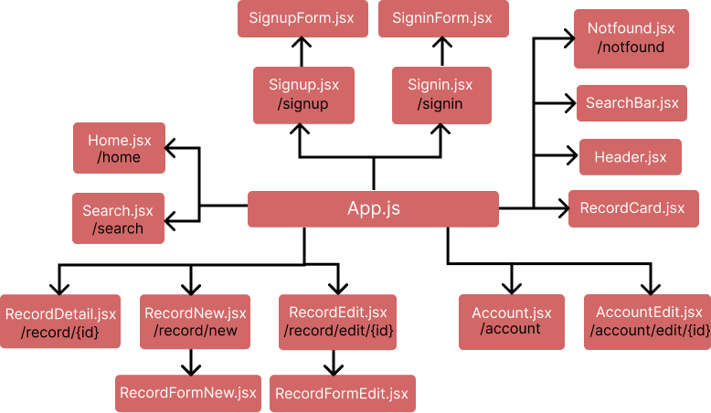
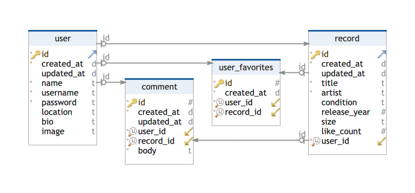
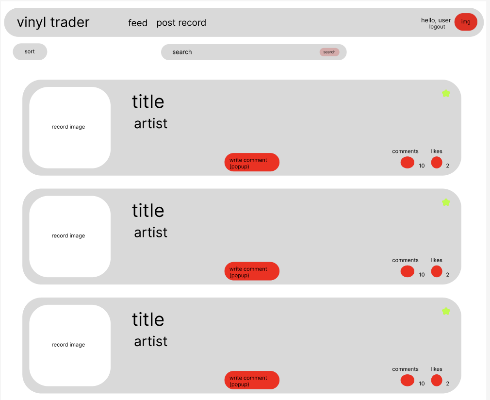
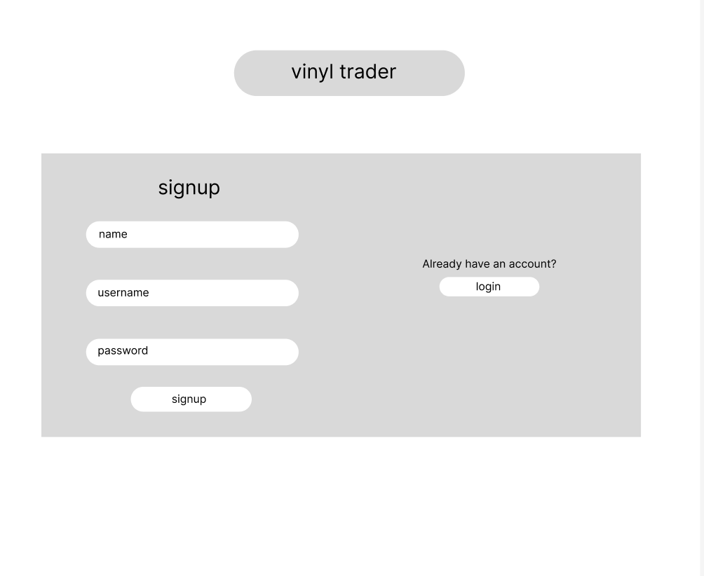
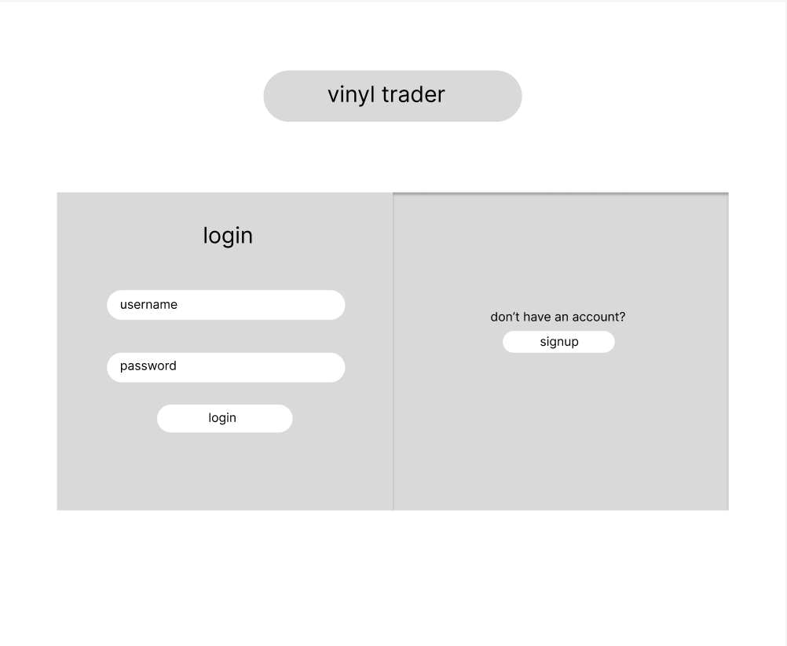
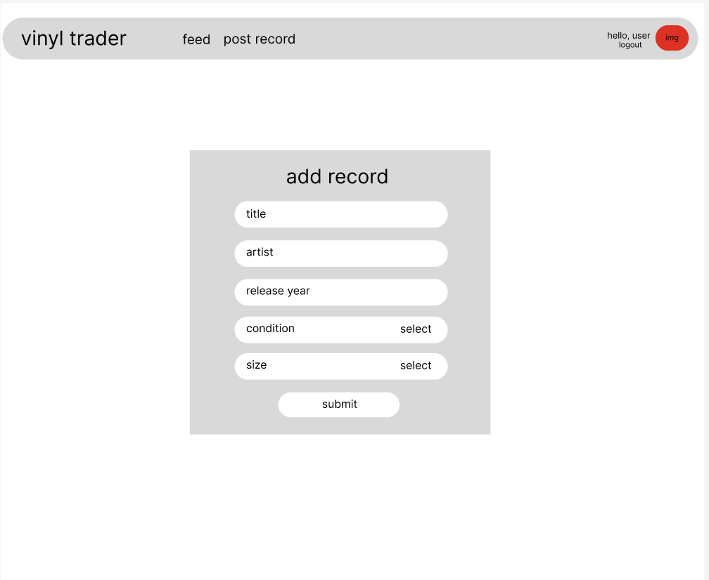
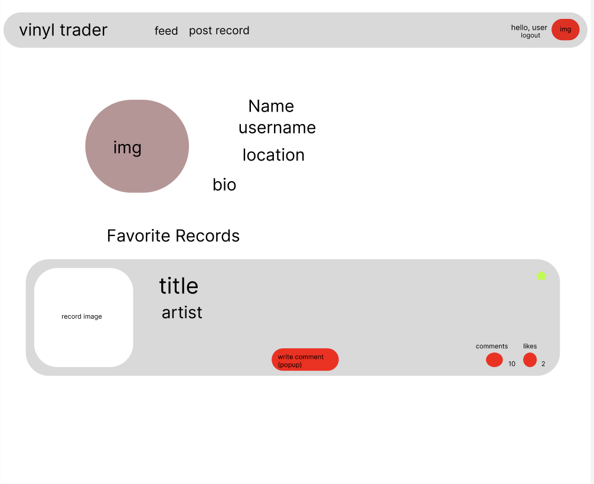

# vinyl trader

vinyl trader is a web application used to favorite and comment on vinyl records. 

## user stories
* users can browse, favorite, like and comment records in a timeline feed.
* users can filter timeline by location, name, price, and date added.
* users can search all listed vinyl.
* users can post their own records to the database.
* users can create, edit, and delete profile.
* users can see all of their posted vinyl and activity in their profile page.

## stretch goals
* users can list records for sale or trade
* ability to actually purchase records (Ecommerce)

## api routes
|route|request|purpose|response|
|:---:|:---:|:---:|:---:|
|/signup|POST|create new user account|{id, username, email}, 201| 
|/login|POST|login current user|{{"message": "login successful"}, "user": {id, username, email}}, 201|
|/logout|DELETE|logout current user|{"message": "logout successful"}, 202|
|user/{id}|GET|get user by id|{id, username, name, email, location, bio}, 200|
|/user/{id}|PATCH|edit user|{id, username, name, email, location, bio}, 200|
|/user/{id}|DELETE|delete user|{}, 204|
|/user/records|GET|gets users records|{username, {records}}, 200|
|/user/favs|GET|gets users favorite records|{username, {records}}, 200|
|/user/favs/{id}|DELETE|deletes user favorite|{}, 204|
|/record|GET|get all records|{{id, title, artist, used, release_year, size, like_count}, {...}, {...}}, 200|
|/record|POST|create new record|{id, title, artist, used, release_year, size, like_count}, 201|
|/record/{id}|GET|get record by id|{id, title, artist, used, release_year, size, like_count}, 200|
|/record/{id}|PATCH|edit record|{id, title, artist, used, release_year, size, like_count}, 200|
|/record/{id}|DELETE|delete record|{}, 204|
|/comments/{record_id}|GET|get comments by record id|{record_id, {comments}}, 200|
|/comments|POST|create new comment|{record_id, user_id, body}, 201|
|/comments/{id}|PATCH|edit comment by id|{record_id, user_id, body}, 201|
|/comments/{id}|DELETE|delete comment by id|{}, 204|
|/search/{name}|GET|search by records name|{id, title, artist, used, release_year, size, like_count}, {...}, {...}, 200|
|/search/{artist}|GET|search records by artist|{id, title, artist, used, release_year, size, like_count}, {...}, {...}, 200|
|/search/{genre}|GET|search records by genre|{id, title, artist, used, release_year, size, like_count}, {...}, {...}, 200|

## client routes
|route|component|
|:---:|:---:|
|/|Home.jsx|
|/signup|Signup.jsx|
|/signin|Signin.jsx|
|/user/{id}|User.jsx|
|/user/edit|UserEdit.jsx|
|/record/new|RecordNew.jsx|
|/record/{id}|RecordDetail.jsx|
|/record/edit/{id}|RecordEdit.jsx|
|/search|Search.jsx|
|/notfound|Notfound.jsx|

## react tree

## db schema

## wireframes
### home & search

### signup

### login

### add record

### user

